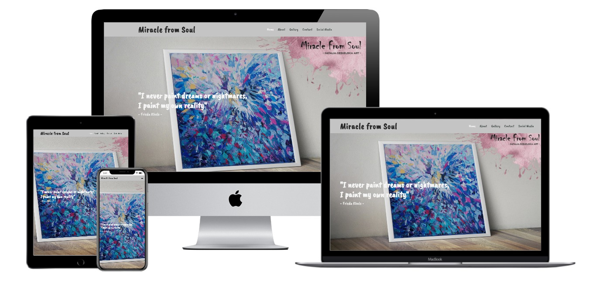

<h1 align="center">Code Institute Milestone Project 1 - "Miracle from Soul"</h1>

Click [here](https://lucascegielski.github.io/MS1-MiracleFromSoul/) to see live project.

# Miracle from Soul

**Miracle from Soul** is a website of a polish artist Natalia Cegielska, my Sister, who is selling her paintings in Ireland.

Website will not only present the existing work of the artist, allow the user to purchase the art 
(feature to be introduced later), but also allows user to contact the artist and by providing inspirations, order the
personalized piece of art - via contact section.

# Table of Content

1.  [User experience](#user-experience)
    - [User Stories](#user-stories)
    - [Design](#design)
    - [Wireframe](#wireframe)
2.  [Features](#features)
    - [Existing Features](#existing-features)
    - [Features left to Implement](#features-left-to-implement)
3.  [Technologies](#technologies-used)
4.  [Languages](#languages)
5.  [Frameworks](#frameworks)
6.  [Libraries](#libraries)
7.  [Other](#other)
8.  [Testing](#testing)
9.  [Bugs](#bugs)
10. [Deployment](#deployment)
11. [Credits](#credits)

# User Experience

## User Stories

This website is for people interested in purchasing paintings made by particular polish artist.

Website will be advertised via artists facebook page as another platform for viewing and purchasing art.

 - Users interested to find out about the artist will have a chance to find out about artist's story and inspirations in **About** section.

 - Users interested in viewing art will have access to artist's gallery in **Gallery** section.

 - Users interested in purchasing art will have a chance to add items from the gallery into basket, a feature that will be added in a later stage of development.

 - Users interested in ordering personalized painting form the artist will have a chance to explain what they need in **Contact** section.

All users will have a opportunity to contact artist via their **social media** accounts and **contact form**.

## Design

When choosing the theme for this project, I have looked at 100s of websites related to art and found out that most of them are
rather difficult to navigate. I had the feeling that those sites are almost "too artistic" to keep any user, who is not an artist,
from loosing interest in navigating them. Almost as if the sites were made by artists, for artists. I felt lost and "out of my league"
when navigating those sites.
On the other hand, most of the Bootstrap based sites, as it was mentioned during the course, look quite similar.
I deicided to go with something very simple, assuming the users are not artists looking for inspiration, 
but average people interested in buying art.
I chose the single-page application (SPA), as I believe, website this size, with limited amount of images and text, 
is more compact and therefore easier to navigate. I also think that potentially, when switching between pages of more traditional
multiple-page application, the page reload time can have a negative impact on UX.

### Templates

- Website uses bootstrap single-page application (SPA) template called "Mentor" and can be downloaded [here](https://bootstrapmade.com/mentor-free-education-bootstrap-theme/). 
Template was heavily customize by me for the purposes of this project. Read more [below](#other).

- Template contains series of links to libraries stored in files that I have copied from the template's folder (folders "vendor" and "js" in assets).

- Contact form template came from [Bootsnipp](https://bootsnipp.com/snippets/5KRq8) and was created by a user name "kastya".

- Template also contains some script links below the footer. Those also came in package.

### Colour

- Colour palette used for this project was taken from [w3schools website](https://www.w3schools.com/colors/colors_shades.asp).

- All colours used for this project are in shades of gray: Nero (#282828), Gray77 (#C4C4C4), Whitesmoke (#F5F5F5).

- Additional colours were used for hover effect: Matterhorn (#505050), Gray88 (#E0E0E0), Nobel (#989898), Trolley Gray (#808080)

- Greyscale was used to expose the colourfulness of artist's work and the environment they operate in.

### Typography

- [Font](https://fonts.google.com/) Caveat Brush was used throughout the project, as per artist's advice to keep it consistant with the logos artist is using outside this page.

- [IcoFont](https://icofont.com/) icons for social media links in footer were imported along with the single page application template 

### Images

All images come from the pictures taken by the artist herself:

- "Hero" image and all images in "Gallery" section of the website present the work of art done by the artist.

- Portrait image in "About" section of the website presents the artist herself.

- "Studio" image in "About" section of the website presents the studio in which artist works.

## Wireframe

- Wireframe was developed using [Figma](https://www.figma.com/)

- Wireframe of this single page application can be seen in browser [here](https://www.figma.com/proto/lThdyqeH1xkHiQkp9kkOMN/Miracle-from-Soul?node-id=22%3A17&scaling=min-zoom)
or in the documentation folder in this project in .jpg file.

[Top](#table-of-content)
# Features

Website allows user to find out about the artist's life and inspirations, view their work and contact them.

## Existing Features

- **About** - allows users to find out about the artist, their life and inspirations.

- **Gallery** - allows users to view artist's work, find out information about each individual painting (work's title & size of painting).

- **Contact** - allows users to send email directly to artists. Users are encouraged to order personalized piece of art, to provide links and ispirations to help artist understand what users need.

- **Social Media** links open in new tab and so far only Facebook and Instagram links take user directly to artist's accounts. 
Artist doesn't have Twitter or Skype account as of now, therefore those links take user to generic location of the two applications.

## Features Left to Implement

- **Purchase** - feature will be added, allowing users to purchase pieces of art directly via website. **Buy** button will be added to each individual image in gallery and the trolley icon will be added in header.

- **EN/PL** - feature will be added, allowing users to switch between English and Polish version of the website, where the whole content will be translated to Polish language.

[Top](#table-of-content)
# Technologies Used

- [HTML](https://www.w3schools.com/html/html_intro.asp)
    - to provide content to a website.

- [CSS](https://www.w3schools.com/css/)
    - to provide style to the content of the website.

- [Java Script](https://www.javascript.com/)
    - to provide some functionalities within a template used.

- [Figma](https://www.figma.com/)
    - to provide wireframe.

- [Mentor](https://bootstrapmade.com/mentor-free-education-bootstrap-theme/)
    - to provide template framework to this website.

- [Bootsnipp](https://bootsnipp.com/snippets/5KRq8)
    - to provide template framework for the contact section of this website.

- [IcoFont](https://icofont.com/)
    - to provide icons to the website.

- [Google Fonts](https://fonts.google.com/)
    - to provide free font to the website.

- [Freeformatter](https://www.freeformatter.com/html-formatter.html)
    - to beautify the HTML code.

- [W3C Validator](https://validator.w3.org/nu/#textarea)
    - to validate HTML code.

- [Jigsaw W3C Validator](https://jigsaw.w3.org/css-validator/validator)
    - to validate CSS code by input.

- [Am I responsive](http://ami.responsivedesign.is/#)
    - to test mobile devices responsiveness of my website.

- [Techsini](https://techsini.com/multi-mockup/)
    - to create this project mockup, of which image is placed at the very top of this readme file.

[Top](#table-of-content)
# Languages

- [HTML5](https://en.wikipedia.org/wiki/HTML5)

- [CSS](https://en.wikipedia.org/wiki/Cascading_Style_Sheets)

- [Java Script](https://www.javascript.com/)

[Top](#table-of-content)
# Frameworks

- [Bootstrap](https://getbootstrap.com/)
    - technology was used throughout the pages.

- [Mentor](https://bootstrapmade.com/mentor-free-education-bootstrap-theme/)
    - to provide template framework to this website.

- [Bootsnipp](https://bootsnipp.com/snippets/5KRq8)
    - to provide template framework for the contact section of this website.
    
[Top](#table-of-content)
# Libraries

- Libraries used in the project came along with the [template](#templates).

[Top](#table-of-content)
# Other

## Excessive code

Due to the use of [templates](#templates), some extra code that seems excesive, can be found throughout the project. 
I removed the parts of the code that seemed unnecessary, since whole sections were removed while styling templates 
for the purposes of this project. Some parts of the code still seem unrelated to the project, but when removed cripple 
the website in some ways and cause issues with styling, layout or functionality. I have allocated hours at the time to 
find out which lines of code can be removed, kept refreshing the site and checking functionalities in mobile, tablet and 
desktop view, looking those functionalities up on the internet and learning plenty in a process.

Both HTML and CSS code were very heavily edited, by myself, for the purposes of this project, including the order of code lines, 
swapping whole modules of code, changing parameters and almost every aspect of the style. The only reason I used the template 
in the first place was to assure the single page application structure.

None of the course's mini-projects used Bootstrap's single page application, so I have used the said template to provide the
blueprint for this project.

Code of the original template I have used can beviewed here: [HTML](documentation/original.html) & [CSS](documentation/original.css).

## Lessons learned

The use of bootstrap templates theoretically makes work more efficient, since it provides big parts of code. However, if
one does not posesses in-depth knowledge of the topic, it can be then time consuming to then tailor the code for ones own
purposes.

In the process of removing the excessive code, I have reduced half the lines of code in index.html and over 2/3 in style.css files.
The remaining lines of code where all looked into and, as I have mentioned already, I have learned about functionalities and 
features (like hero image carousel, etc.), that were in the end not applied to this project.
However, through trial and error, I found out that certain lines of code, even tough they seemed unrelated, when removed,
cause certain parts of website to crash.

[Top](#table-of-content)
# Testing

I have performed thorough testing of this project's website and all of it's functionalities.

Also all features within this README file were tested.

Code:

- The HTML code was tested using [Jigsaw](https://jigsaw.w3.org/css-validator/validator) and produced some minor errors that I have cleared.

- The CSS code was tested using [W3C Validator](https://validator.w3.org/nu/#textarea) and produced some minor errors that I have cleared.

Browsers:

- project was tested in Chrome browser only. Mozilla and Firefox browser where crashing my laptop when installed. I tried to fix this issue, but it seems that due to equipment mulfunction, I can only test this project in Chrome.

Desktop, Tablet & Mobile view:

- Website's responsivness was tested on mobile devices with a use of:

    - ["Am I responsive"](http://ami.responsivedesign.is/#) facility.

    - Google Chrome DevTools.

Links:

- all links on this website were thoroughly tested,
- all tags in navbar lead to correct section of the website
- all links open in new window (social media links & credits link in footer),

Contact Form:

- Contact form was tested by trying to input incorrect data (i.e. letters in numbers field) or no data at all and displays error before the submit can be done.

- When valid data is input, form sends data as intended. Code Institute formdump was used in this project.

Back-to-top arrow:

- Arrow is correctly displayed, the hover effect shows user it is active and performs correct action when clicked (takes user to the top of the page).

Readme file:

- Table of contents remains interactive and takes user to correct parts of the file.

- Back-to-top link feature was added at the end of each chapter to allow user to easily navigate the file. 

[Top](#table-of-content)
# Bugs

Most bugs were cleared thanks to my Mentor Aaron, Tutor Igor and the use of the HTML and CSS validators.

## Not fixed

- Some images across the project, sometimes are not opening immediately and require a second page refresh with cleared cache (ctrl + refresh).

- When you look at the dropdown menu taking you to social media links in navbar (in mobile or tablet view), the arrow turns into a rectangle.

[Top](#table-of-content)
# Deployment

## Begining

- I have used the cloud-based IDE [Gitpod](https://gitpod.io/) and [GitHub](http://github.com/) as a free git repository hosting.

- As first step, I have installed the [Gitpod extension](https://chrome.google.com/webstore/detail/gitpod-dev-environments-i/dodmmooeoklaejobgleioelladacbeki) for Chrome browser that I use.

- Next, I created repository on [Github](https://github.com/) using the gitpod template provided by the [Code Institute](https://github.com/Code-Institute-Org/gitpod-full-template).

- Then, I clicked on "Gitpod" button, which opened workspace in Gitpod, where I created my project.

- Once in Gitpod, the following commands were used while developing this project:
    - "git add (file name)" - to add files for staging.
    - "git status" - to see what is the current status of directory and staging area.
    - "git commit -m "(description of action taken)" - to commit changes along with short comment of what was done.
    - "git push" - to push commits to Github.
    - "python3 -m http.server" - to open ports allowing me to view the current state of the website in Chrome.

## Running project locally

- In order to run this project locally, follow the below steps:

    - Click on the [link](https://github.com/LucasCegielski/MS1-MiracleFromSoul) to this project's repository in GitHub (you must be logged into your own Github account).
    - Click on the dropdown menu Code button located next to green "Gitpod" button.
    - Click on "Open with GitHub Desktop" to clone and open the repository locally.
    - Click on the "Choose" option and navigate to the local path where the cloned repository should be located.
    - Click "Clone".

- For more details on how to clone repository in Github see [here](https://docs.github.com/en/github/creating-cloning-and-archiving-repositories/cloning-a-repository).

[Top](#table-of-content)
# Credits

## Content

- Single-page application template called **Mentor** was used as blueprint for this project and can be viewed [here](https://bootstrapmade.com/mentor-free-education-bootstrap-theme/).

- The quote on the home page comes from artist Frieda Khalo.

- The text for sections was written by myself based on the materials provided by the artist.

## Media

- The photos used in this site were obtained from the artist's [Facebook website](https://www.facebook.com/MiracleFromSoul) and were provided from private collection, by the artist herself via email.

## Acknowledgements

- My Mentor Seun, for help and inspirations.

- My Mentor Aaron, for help and inspirations (for organizational purposes my Mentor was replaced on my request).

- Tutor Igor for very clear feedback and much appreciated help & guidance. 

- My Sister, the artist, for pictures, some good ideas and inspirations.

- [Stackoverflow](https://stackoverflow.com/), Slack and Github communities for feedback and troubleshoot throughout.

- [Code Institute Student Care](https://codeinstitute.net/) for all the much appreciated admin help.

[Top](#table-of-content)